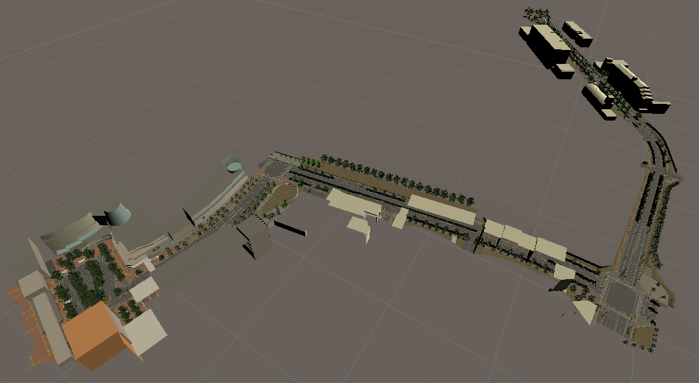

# kashiwanoha_world_unity
  
Kashiwa No Ha Campus world data.

This repository is ONLY for the world (environment) data of Kashiwa No Ha Campus.  
If you may have interests including robot model, visit [vtc_unity](https://github.com/Field-Robotics-Japan/vtc_unity) repo, please.

If you have any Issues, or need bug tracking, visit [vtc_unity/issues](https://github.com/Field-Robotics-Japan/vtc_unity/issues) page, please.

# Installation
Just clone this repository and open them from Unity Hub.  
The Unity version is 2019.10.3f.

# LICENSE Dependencies
- [FBX data](./Assets/kashiwanoha_world_unity/FBX) : [CC BY 4.0](https://creativecommons.org/licenses/by/4.0/) by [National Institute of Advanced Industrial Science and Technology （AIST）](https://www.aist.go.jp/)  

# LICENSE
Copyright [2020] Ryodo Tanaka groadpg@gmail.com

Licensed under the Apache License, Version 2.0 (the "License"); you may not use this file except in compliance with the License. You may obtain a copy of the License at

http://www.apache.org/licenses/LICENSE-2.0

Unless required by applicable law or agreed to in writing, software distributed under the License is distributed on an "AS IS" BASIS, WITHOUT WARRANTIES OR CONDITIONS OF ANY KIND, either express or implied. See the License for the specific language governing permissions and limitations under the License.
